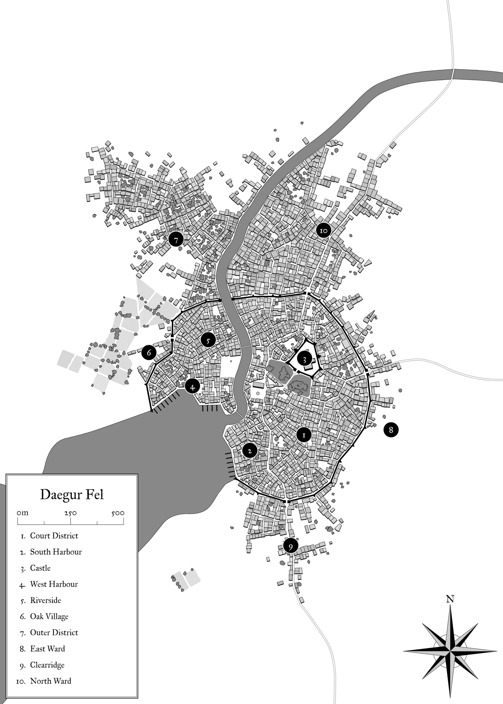

# The City of Daegur Fel

> While the city Daegur Fel existed in the old kindom of Daeger, and what is now Daegur Fel is the city rebuilt, and while its name in the old tounge translates roughly into "Highest of Daegur", the irony of the name after the fall of the old empire is not lost on its people.
>
> _Elensa Polmik, "The Great City", the year 715 past rift_

The jewel of the southlands, if the slums and filth of the streets of the north ward are ignored, the city of Daegur Fel is the largest city in the southlands with around 20,000 residents in and around her, and was built from the ruins of the old city of the same name that was the capital of the old Daegur empire. It sits on land that borders the coast in a major shipping port, straddles a river, and intersects multiple overland routes to various cities, demonstrating why it holds the title of most populous city as it is the center of commerce of all kinds.

Its port is one that is south of the peninsula of the coastlands to the west, and so its shipping lanes to those lands and its own to the south and beyond are cut off from the waters of the Union of Coastland Republics and the pirates that hold those waters, and so finds the way far safer than those shipping channels to the north.

As with nearly all cities that connect the main thoroughfares, Daegur Fel is largely made up of humans, who also hold all of the political seats and comprise virtually the entirety of the land owning nobility of the area. Non-human races are generally contained to certain poorer districts, though as the large majority of the poor are humans as well, there are generally less antagonistic relations in those districts than there would seem to be when considering the demographics and the ideology of the nobility.

Given the cities location, it is well established as a center of commerce, being a central port on the western coastlands and forming a node between multiple overland trade routes. The cities primary exports include fish and handicraft goods, the latter coming from the substantial section of the residents that work within the guilds, and in Daegur Fel find many a market for their goods. Along these economies is a small but healthy agricultural output, largely providing food for the city and having little exports, the city indeed some seasons finding it is importing a portion of the food it consumes, a rare thing for any town but the very largest.

As an influential interest group, the guilds, while certainly not making up a unified position, often find themselves on the same side in conflicts over the policies and conditions of the city as represented by the nobility.  Those nobles who control the city council, largely made up of the most wealthy houses, would rather dictate the terms of commerce and labor themselves, better suited towards unfettered control, and so finding themselves often frustrated by the ever increasing power wielded by the guilds.

## The City Council
A body of representatives numbering 30 seats, their placement decided by a ranked vote, where each parcel of land can be used in casting a single vote, thus those who own the land do rule it, and in ruling it extract from the craftsman a heavy toll, having relatively fewer peasants bound to their land than their rural counterparts. The council largely manages its own affairs, and while it is legally under the purview of the high houses, their number have among them many from those very houses, and so largely do as they see fit, only suffering under the power struggles largely internal to the council. 

## The Order of Ilmater

## The Theives Guild
The guild here is one of particular influence, though who’s allegiances are more accurately described as “opportunistic”, it is still a guild-like body of sorts and as such is generally in conflict with the positions of the council’s directions.