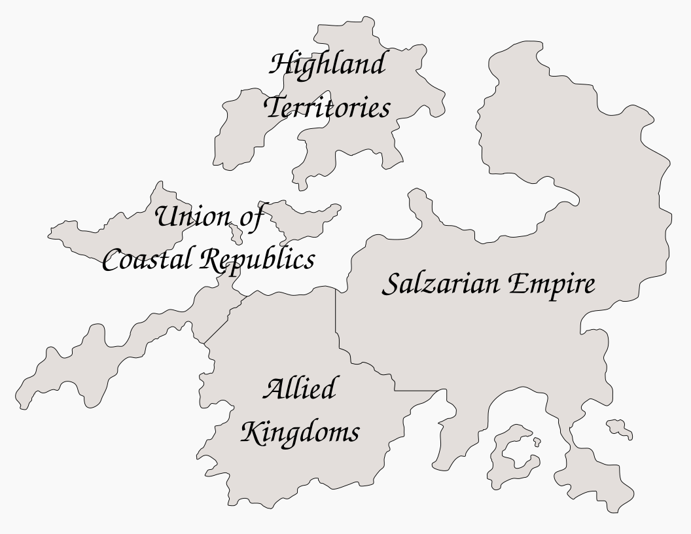

# The Realm

> Under the gray sky, amidst ash and disease in a baren land, I hope to raise my child and wonder at the wisdom of it, for what have I to offer her but the constant pain of hunger? Is it not a curse giving her to a land where one is more likely to consume her flesh than share the fire? Perhaps I reach to cover the reality of her needs in the face my own which are on their own rarely met. This land of torment has nothing yet to give to me, and yet I find myself holding a child, torn between a mothers love, the fear of the world she would face, and the knowledge of the burden she represents. I dare not consider what will come of me and her in the days that follow.
>
> _Anonomous Woman, page of a journal, the early ashen ages_

The realm is a vast arrangement of land that centers around the large mass that makes up the main continent, on this land mass roughly center right are 3 vast volcanic canyons. Off the coasts of the main continent are a set of some large some small islands surrounding it, with the northern most island beng the largest and near to holding the title of continent itself.

## Lands and Kingdoms
The realm is made up of 4 different forces of national and territorial sorvereignities.

### The Highland Territories
The most northern is the Highland Territories, a land of cold forestland and in the far north a near year round freeze can be observed, though the lands most southern are rounded temperate and bountiful, and the barbarians that live in these lands are largely made up of two races, dwarves and orcs. In the southern coasts there is a near constant battle being played out, at times as the Salzarian Empire seeks to conquer the lands, but for decades now they have come only to be pushed back, and in the lapses between the imperial invasions the temporary alliances of the barbarian kings end and they proceed to continue to fight with each other, the territories of the highlands as a result harbor peoples of war, warborn some call them, and they are constantly raiding the islands of the coastal republics to the south, though they often find themselves on the waters with the dread pirates that roam there, and even they are found to be no match for the prowess those pirates have in the water.

### The Salzarian Empire
The Salzarian Empire, the largest of land and population, taking up the eastern side of the continent, is a largely human inhabited land, and competes with the southlands (or the Allied Kingdoms) for dominance over the mass of the land that holds the rifts. They were the first to emerge as an organizaed state force after the ashen ages made by the rifts, and since then have maintained their position as the hegemon, though the allied kingdoms are on their heels, and the central position of the rift borderlands to their empire is a deteriment to their maintaining a cohesive state, with their dominance one of largely military force and less of economic or political or diplomatic influence, in technology and infrustructure they were surpassed by the allied kingdoms some time ago as they inherited the best artifacts of the old kingdom.

### The Southlands
The Allied Kingdoms, known as the southlands, are the inheritor of the culture and what was left of the major centers of towns and trade that once were under the rule of the old kingdom, the Daegur Empire, and have come to be in recent decades an upstart that the Salzarian Empire sees each day as a larger threat to their hegemony.

### The Union of Coastal Republics
The Union of Coastal Republics, a largely tropical region of islands and coastal lands, are a loose and disorganized collaberation of states that have, despite the name, not at any time all conformed to the title "Republic", with much of these lands still being under the rule of monarchs and still others remain unaligned and quasi-independent. In those seas, however, it is no question that pirates reign supreme. For this reason it is understood by many that those states that make up the union are in fact simply the bearers of the land that is in truth under the control of the pirates, who some say stand closest to the ideal of republic that gave this union its name, and the pirates that roam those waters have organization and scope that not one of the states can compete with, given the sea is where they find their bounty and means of trade and transport. These lands are the most diverse of race and culture and among the pirates it is said no race nor heritage is besmearched and all live as equals under the law of the sail and sword. Others contest this view in light of the fact that all those peasants and folk of the land fall under the tyrany of the pirate raiders and as such they can be seen as nothing more than bandits and owtlaws.

## The Rifts
A near 700 years past, there came to be a force that would bring with it unimaginable devestation to the world that was then so rich, a force that rent the world in three long tortured raveens of fire, as though a beast god had taken its claws to the land and torn through the middle of the continent, leaving three seemingly endless cracks in the earth wider than a town, and deeper in places than small mountains stand. Since that day, the three giant rifts that span the continent north to south at the west end of the Salzarian Empire, have never ceased to smolder, like a great wound that will not heal.

Inside is found a hot labrynth of black obsidian in flowing and jutting formations, occasionally a crack will glows orange with molten rock as the black rock becomes a slow moving river of lava.  There are places at night where for miles the orange glow can be seen scattered across the deep canyonds of the rift, for those foolish enough to stand near those most active edges and tempt the gods.

It is said that there are places that can be descended into, as though they were canyonds and not active volcanic pits of hellspawn and fire always not far from the surface, and for those that have dared try, are said to have found inside vast tunnels of black rock, and natural cathedrals of obsidian spines.

Those who inhabit the rift borderlands, those largely desolate lands under constant threat of eruption, know first hand of the horrible creatures of fire and brimstone that reside deep within the rifts and prey on those that venture too close.

## The Passing of Dragons
Near the same time as the rifts were to be forged were the last days of the dragons, or so it is thought, and too their kin the dragonborn. Only the meak dragonfolk known as "kobolds", the rift boarderlands now their forsaken homelands, are said to have survived, though talk of hidden communities of dragon descended and even dragons can always be found in a tavern where lore is abundant.

They found their end in a war against the Daegur Empire of the time, a war started by that old kingdom of Daegur in a struggle against the once dominion that dragons held over the land, and in a way that would play out over a century it is said, the humans of Daegur slowly came to dominate and their war soon became a war of extermination.

Because of the timeline and the emergence of the rifts around the same time, many believe it was this war that was the cause of the magic that spawned the rifts, and while it is often blamed on the dragons that are now lost to history, these claims have little basis in fact, and come largely from the chavinism of the humanfolk that plagues the lands of the world to this day.

## The Arcane Arts

While the divine and natural magics are generally better tolerated (though often are caught in the fray as difficult for the layman to distinguish in some cases) the attitudes towards arcane magic are muuch worse, though they have come far over the last century, particularly the last few decades. While magic users of this kind were in the ashen ages generally stoned without a trial or a consideration of the accused, now they are simply looked upon as vile and dark, but not always are their lives forfeight. The ways of the arcane arts given the history have come to develop a highly secretive way of life and still largely remain anonomous where they can help it, and only in the black markets of large towns can the occasional non-trivial magic items of arcan origin be found for sale. Outside this there are those places hidden here and there where those who know where to go have better luck.